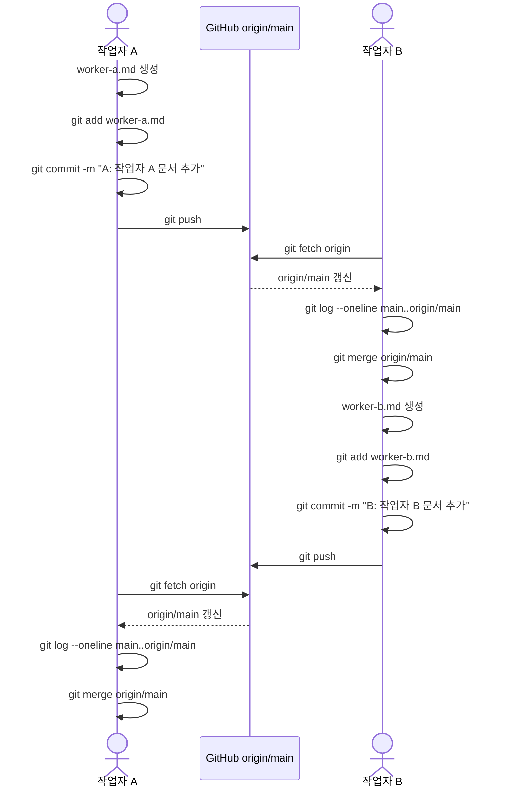
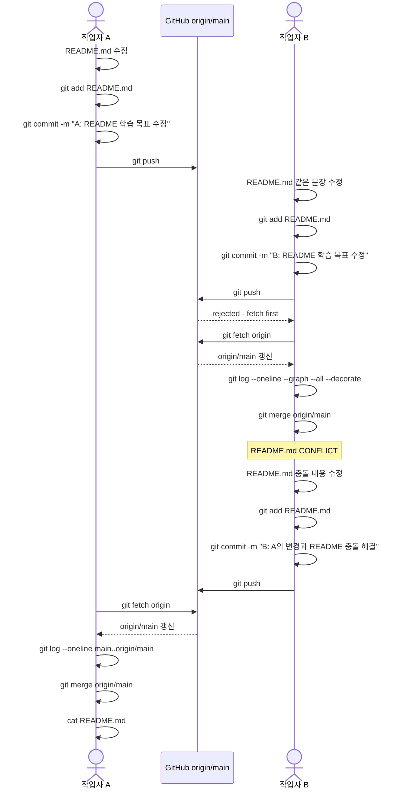

# 2026-git-start

로컬에서 추가한 내용입니다!
github 웹에서 추가한 내용입니다

오늘의 학습 목표: 작업자 B의 Merge 충돌 실습

오늘의 학습 목표: Git 협업 이해
오늘의 학습 목표: 작업자 A의 Git 협업 실습

# Git 협업 실습 Sequence Diagram

## 1단계. 충돌 없는 협업

## 2단계. Merge 충돌 및 해결

